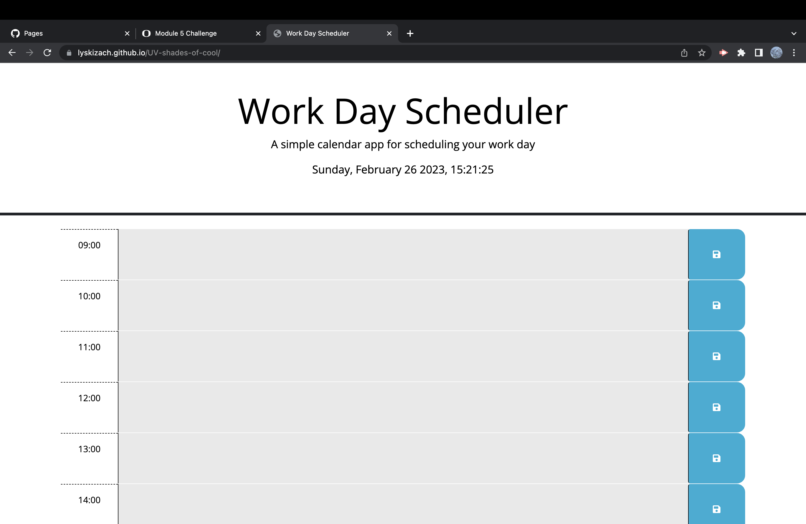

# UV-shades-of-cool

In this challenge, I modified the given starter code to create a fully functional workday planner. The planner can save input data, and get it via local storage. It includes the current time at the top of the page, and color codes the time blocks depending if they're in the past, present, or future.

I recieved support from AskBCS Learning Assistants twice.
1- properly identifying the Save Button for my click event listener
2- understanding what it means to wrap all interaction with DOM in "$(document).ready(function () { }"

## Screenshot of Deployed Link
""
## URL
https://lyskizach.github.io/UV-shades-of-cool/